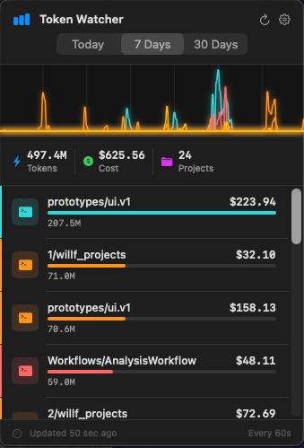
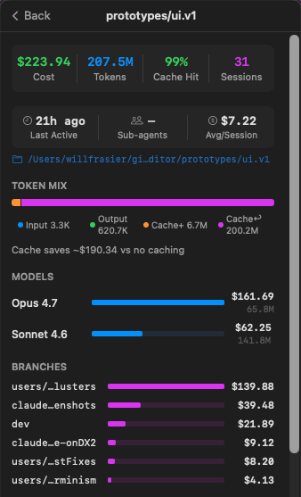
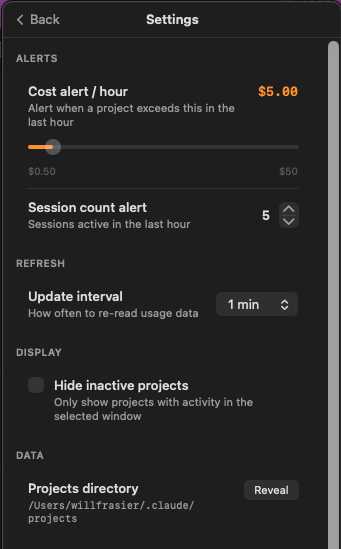
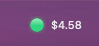

# TokenWatcher

**TokenWatcher** is a small **macOS menu bar app** that summarizes **Claude Code token usage** from your local project history: totals by window (today / week / month), per-project breakdown, simple charts, optional alerts, and rough **USD estimates** from bundled pricing defaults (editable in Settings).


> **Disclaimer:** TokenWatcher is an independent open-source tool. It is **not affiliated with, endorsed by, or supported by** Anthropic or Claude. Claude and related marks belong to their respective owners.

---

## Screenshots

**Main window**



**Project details**



**Settings**



**Menu bar & icon**



---

## What it does (in ~60 seconds)

1. Reads **local** JSONL logs under `~/.claude/projects/` (one folder per Claude Code project).
2. Parses **`assistant`** messages that include **`usage`** (input, output, cache create/read tokens).
3. Aggregates usage by project and time range, refreshes on a timer, and can show **menu bar** summaries and **alerts** based on your rules.

**Requirements:** macOS **13** (Ventura) or later. Built with SwiftPM as a single executable target.

---

## Privacy & safety

| Topic | What TokenWatcher does |
|--------|-------------------------|
| **Network** | The app does **not** open network connections for usage parsing; it reads **files on disk** you already have from Claude Code. |
| **Data sent anywhere** | Nothing is uploaded by this codebase; usage stays on your Mac unless *you* use other tools outside this app. |
| **What it reads** | Primarily `~/.claude/projects/**` and your app preferences (UserDefaults / standard macOS storage for settings). |
| **Secrets** | Treat project folders like any local developer data: they may contain paths or metadata you consider sensitive—only run builds you trust. |

If you audit the code, start with `UsageParser.swift` (paths + parsing) and `UsageStore.swift` (aggregation).

**Responsible disclosure:** see **[SECURITY.md](SECURITY.md)** for how to report security issues privately.

---

## Install & run (from source)

```bash
git clone https://github.com/WillFrasier/token-watcher.git
cd token-watcher   # or the directory name you cloned into

swift build -c release
open .build/release/TokenWatcher   # or: ./.build/release/TokenWatcher
```

To open in **Xcode** (optional): generate or maintain an Xcode project if you add one; today the canonical build is **SwiftPM** via `Package.swift`.

**Gatekeeper:** Unsigned local builds may trigger macOS security prompts. For public distribution, use **Developer ID** signing and **notarization** (see [Apple’s notarization docs](https://developer.apple.com/documentation/security/notarizing_macos_software_before_distribution)).

---

## Maintenance expectations

This project is maintained **on a best-effort basis**. Issues and PRs are welcome, but there is **no SLA** for reviews or releases. If you need a guarantee of ongoing support, treat this as **“use at your own risk”** and consider forking.

See **[CONTRIBUTING.md](CONTRIBUTING.md)** for scope, what kinds of changes merge quickly, and ideas labeled as good starter work.

---

## Roadmap ideas (help welcome)

- **Prebuilt releases:** signed `.zip` / `.dmg` attached to GitHub Releases.
- **Homebrew cask:** formula pointing at a stable release URL.
- **Sparkle** or similar for auto-updates on direct downloads.
- **Tests** for `UsageParser` edge cases (malformed lines, empty dirs, large files).

---

## Contributing

Please read **[CONTRIBUTING.md](CONTRIBUTING.md)** before opening a PR. TL;DR: small, focused changes with a clear problem statement get merged fastest.

---

## License

Licensed under the **MIT License** — see **[LICENSE](LICENSE)**. After you publish the repo, consider replacing the copyright line in `LICENSE` with your legal name or `Copyright (c) YEAR Your Name`.

---

## Star / fork

If TokenWatcher is useful, a **star** helps others discover it. **Forks** and PRs are more valuable than stars for long-term health—both are appreciated.
